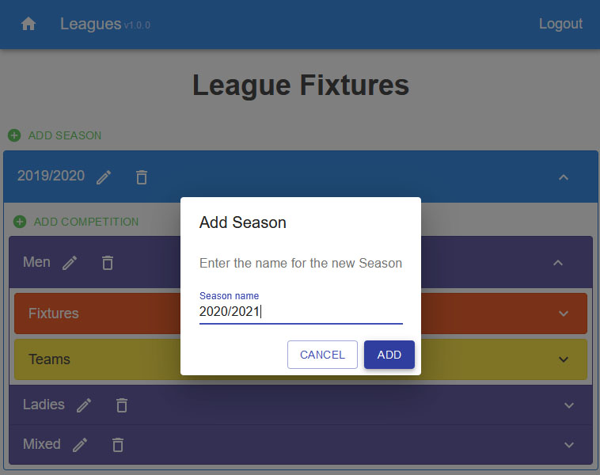

# Leagues

A Node.js web application for managing sports leagues



## What is it?

Leagues is a [Node.js](https://nodejs.org/en/) web application implemented using [React.js](reactjs.org/) intended to track match schedules for team-based sport leagues.  It is originally intended for the local volleyball leagues I run.  

## What does it do?

Leagues contains an [API](./api/v1/swagger.yaml) for defining the teams and matches within a league.  The web console provides an editor that uses that API, an importer for loading data from a CSV file, and a reminder capability for reminding teams of their pending matches (this requires access to an SMTP server/relay).

## What does it _not_ do?

- Leagues does not calculate match schedules; that must be done before loading the matches into the API.
- Leagues does not store match results, or present league standings.

## How do I use it?

### Prereqs

You'll need the following:

- A [Node.js](https://nodejs.org/en/) runtime
- A [MariaDB](https://mariadb.org/) server (formerly MySQL)
- Some TLS certificates for the machine you want to run on

### Setup and Install

- Install a Node [Node.js](https://nodejs.org/en/) runtime
- Install [MariaDB](https://mariadb.org/) and create a user and a database for the User database.  I do something like the following to create a database called `leagues`, and run the web application on the same server as the database:
  - Connect to MariaDB as an administrator and create a database user for Leagues by running:
    - `> CREATE USER '{username}'@'localhost' IDENTIFIED BY '{database password}';`
  - Create a database for Leagues and grant permission to the new database user:
    - `mysql -u{username} -p`
    - `> create database leagues`
    - `> create user '{username}'@'localhost' identified by '{database password}';`
    - `> grant all on leagues.* to '{username}'@'localhost';`
- Download and expand the latest leagues-{semver}.tgz file
- Install the Node.js packages and build the React code by running `npm run install-release`
- Create the file `config/production.json` as a copy of `config/development.json`
  - Add the Database Connection details, using your new database username and password.  Note that the code expects MariaDB to be running on the same machine as the application.
  - Add a long random string as `jwtSecret`
  - Add the domain of the machine as `jwtIssuer`
  - Set the HTTPS port for the application
- Create a user for Leagues by running `node ./leagues.js addUser {username}` (this will prompt you for a password). This will add a user to the users database, and will be the account that you log in to the web console as.
- Create some TLS certs for the server and put them in the `cert` directory.  See [./cert/README.md](./cert/README.md) for details.

Note that I don't store the actual Leagues data or the reminders config data in a database, but just store them in files in a directory in the application (this was the simplest thing to implement for something this small).  Given that this data may contain email addresses and credentials for an SMTP server, you will want to lock down the permissions on the `data` directory.

### Running

- Run `npm start`.  You can run this under some process manager, like [PM2](https://www.npmjs.com/package/pm2).
  - You should see logs sent to the console.  You can control the log level in the config file.
- Point your browser at the web console, which will be running on port 3001 (or whatever port you specified in the config file).
- Log in with the username and password you defined earlier.

### The API and the Data

The API can be called directly at the endpoint `/api/v1` (although you'll need the same JWT that the UI gets when you log in), or via the League Fixtures panel in the web console.  The data structure is given in the API's [swagger document](./api/v1/swagger.yaml), and is summarised below:

- A `League` is the root component of the data.  There is only one and it has no name.  A `League` contains `Seasons`:
  - A `Season` represents a collection of `Matches` within a time-bound period, e.g. a `Season` may cover the "2019-2020" competitions.  A `Season` contains `Competitions`:
    - A `Competition` is a container of the `Teams` and the match `Fixtures`.  If there are multiple divisions or gender-splits, each is expected to be a separate `Competition`, e.g. "Ladies Division 1".  A `Competition` contains list of `Teams` and a list of `Fixtures`
      - `Teams` is a list:
        - A `Team` is the entity that participates in `Matches`, e.g. "London City All Stars".  You cannot delete a `Team` if it still has match responsibilities in the list fo `Fixtures` in this `Competition`.  A `Team` contains `Contacts`:
          - A `Contact` is represented by an email address, and is who match reminders are sent to.  This field is optional.
      - `Fixtures` is a list:
        - A `Fixture` is a collection of individual matches with a common venue.  A `Fixture` has a Date (when the matches take place), a Venue (where the matches take place) and optionally and Adjudicator (a team that is responsible for managing the fixtures on that date).  A `Fixture` contains `Matches`:
          - A `Match` represents a real match.  It has a Start Time, two participating `Teams` and a third refereeing `Team`.

For example:
- `League`:
  - `Season` "2019-2020":
    - `Competition` "Mens":
      - `Teams`:
        - `Team` "London City All Stars"
          - `Contact` "joe@example.com"
        - `Team` "East Ham United"
        - `Team` "River South"
      - `Fixtures`:
        - `Fixture` "Friday 18th October at City Sports Hall (River South adjudicating)":
          - `Match` "19:00 - London City All Stars v East Ham United (River South ref)"
          - `Match` "20:00 - East Ham United v River South (London City All Stars ref)"
          - `Match` "21:00 - River South v London City All Stars (East Ham United ref)"

### The Web Console

**League Fixtures** is the main editor for the data.  It represents the data in the same hierarchy as described above.  You can add, edit and delete each individual resource.

**Populate League** allows you to import league data from a CSV.  This repository does not contain an example spreadsheet (a programmer's spreadsheet is their own business), but the CSV must obey the following format:

```basic
Date (of the form "Day date-month-year"),Time (of the form "HH:MM"),Venue,Competition Name,Team1 Name,Team2 Name,Referee Team Name,unused,unused,unused,unused,unused,unused,unused,unused,unused,unused,unused,unused,unused,unused,unused,Adjudicators
```

_the unused fields are because I use spreadsheets that also contain the match results, which isn't supported in the Leagues application yet_

For example:

```basic
Fri 18-Oct-19,19:00,Woodlands,Men,London City All Stars,East Ham United,River South,,,,,,,,,,,,,,,,London City All Stars
```

The importer lets you analyse the data using the same UI as the _League Fixtures_ viewer before committing the data to Leagues.

**Match Reminders** Controls how email reminders are sent to the teams.  This page will show details on the next email to be sent, if the email reminders are enabled.
- You must have access to an SMTP server/relay; you can define the SMTP connection under the "SMTP Config"
- You can define the content and the reminder timing of the email under "Email Config"

**League Contacts** is a simplified API viewer/editor for the team contacts.

**League Matches** is a simplified viewer for the matches that each team is scheduled to play in (it does _not_ include any refereeing responsibilities).  This is typically used for manually generating invoices for each team.

## History

Leagues started as a way to learn how to use React.js.  I find that the best way of learning something new is to use it to make something, and I wanted to automate sending reminders to the teams in the leagues that I organise, so this was the perfect candidate.

I could have gone further and used [webpack](https://webpack.js.org/) (I think this app is too small to worry about) and [Babel](https://babeljs.io/) (I don't care enough about supporting old browsers), but this does what I need.

I also break one of the design rules of [Material-UI](https://material-ui.com/) by putting `Accordions` within `Accordions`; the usual argument against them is to use `Tree View` but I have different entities at each level (rather than just folders of resources).  I also think this looks better anyway.
